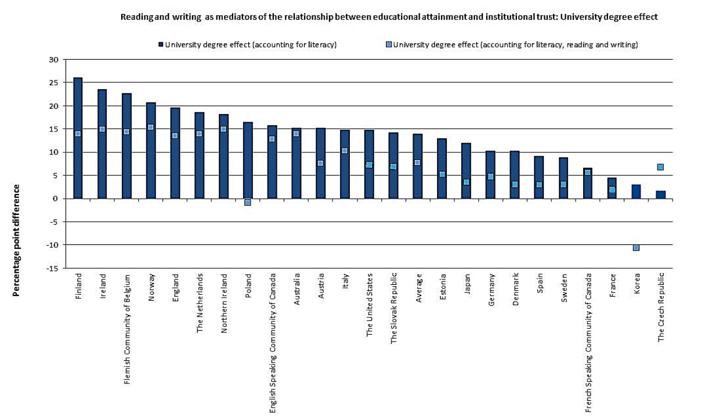

#######
Summary
#######

Briefing points for the OECD Secretary General:

* GDP is not a significant corollary with the university degree effect
* All the countries listed in the graph are members states of the OECD
* Differences in opinion within countries (e.g., Canada and Belgium) also exist along linguistic and cultural demarcations
* The "university degree effect" represents the difference in the percentage of reporting disagreeing or strongly disagreeing with the statement "I have no say in what the government does" between an individual who has lower secondary qualifications or less and an individual who has a university degree

	Reading and writing as mediators of the relationship between educational attainment and institutional trust.